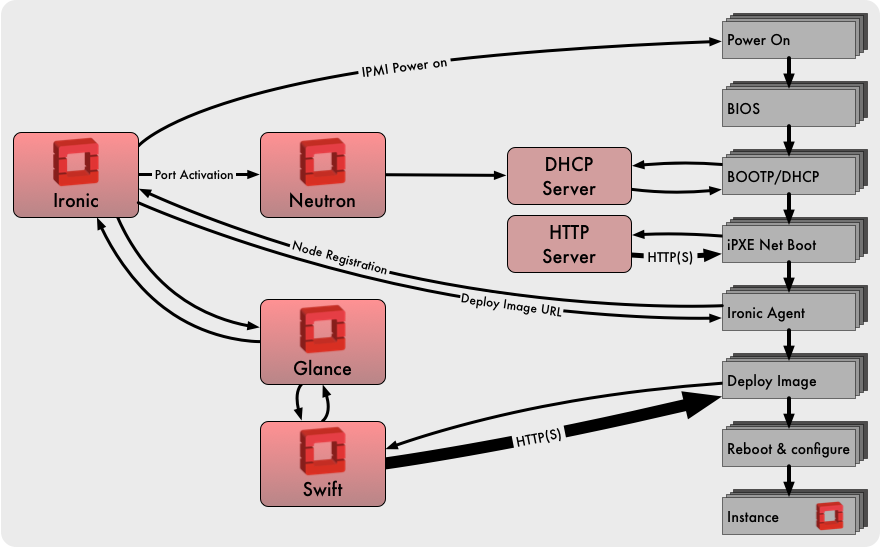
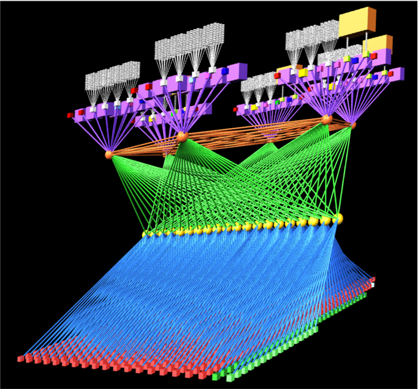
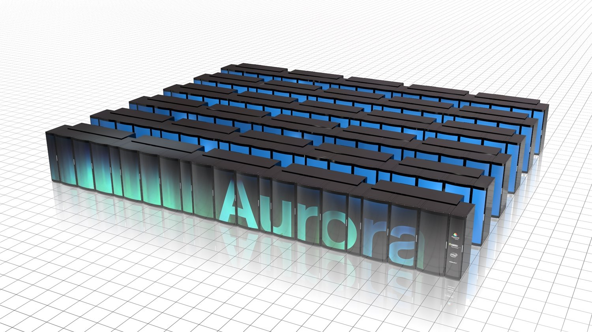

OpenStack and HPC Infrastructure Management
###########################################

In this section we discuss the emerging OpenStack use case for management
of HPC infrastructure.  We introduce Ironic, the OpenStack bare metal
service and describe some of the differences, advantages and limitations
of managing HPC infrastructure as a bare metal OpenStack cloud.

Compared with OpenStack, established approaches to HPC infrastructure
management are very different.  Conventional solutions offer much higher
scale, and much lower management plane overhead.  However, they are also
inflexible, difficult to use and slow to evolve.

Through differences in the approach taken by cloud infrastructure
management, OpenStack brings new flexibility to HPC infrastructure
management:

* OpenStack’s integrated support for multi-tenancy infrastructure
  introduces segregation between users and projects that require isolation.
* The cloud model enables the infrastructure deployed for different projects
  to use entirely different software stacks.
* The software-defined orchestration of deployments is assumed.
  This approach, sometimes referred to as “infrastructure as code”,
  ensures that infrastructure is deployed and configured according to a
  prescriptive formula, often maintained under source control in the same
  manner as source code.
* The range of platforms supported by Ironic is highly diverse.  Just about
  any hardware can and has been used in this context.
* The collaborative open development model of OpenStack ensures that
  community support is quick and easy to obtain.

The “infrastructure as code” concept is also gaining traction among
some HPC infrastructure management platforms that are adopting proven
tools and techniques from the cloud infrastructure ecosystem.

Deploying HPC Infrastructure at Scale
=====================================

HPC infrastructure deployment is not the same as cloud deployment.
A cloud assumes large numbers of users, each administering a small
number of instances compared to the overall size of the system.  In a
multi-tenant environment, each user may use different software images.
Without coordination between the tenants, it would be very unlikely for
more than a few instances to be deployed at any one time.  The software
architecture of the cloud deployment process is designed around this
assumption.

Conversely, HPC infrastructure deployment has markedly different
properties:

* A single user (the cluster administrator).  HPC infrastructure is a
  managed service, not user-administered.
* A single software image.  All user applications will run in a single
  common environment.
* Large proportions of the HPC cluster will be deployed simultaneously.
* Many HPC infrastructures use diskless compute nodes that network-boot
  a common software image.

In the terminology of the cloud world, a typical HPC infrastructure
deployment might even be considered a “black swan event”.  Cloud
deployment strategies do not exploit the simplifying assumptions that
deployments are usually across many nodes using the same image and for
the same user.  Consequently, OpenStack Ironic deployments tend to scale
to the low thousands of compute nodes with current software releases
and best-practice configurations.  Network booting a common image is a
capability that only recently has become possible in OpenStack and has
yet to become an established practice.

Bare Metal Management Using OpenStack Ironic
============================================

Using Ironic, bare metal compute nodes are automatically provisioned at
a user’s request.  Once the compute allocation is released, the bare
metal hardware is automatically decommissioned ready for it’s next use.

Ironic requires no presence on the compute node instances that it manages.
The software-defined infrastructure configuration that would typically
be applied in the hypervisor environment must instead be applied in
the hardware objects that interface with the bare metal compute node:
local disks, network ports, etc.

Support for a Wide Range of Hardware
------------------------------------

A wide range of hardware is supported, from full-featured BMCs on
enterprise server equipment down to devices whose power can only be
controlled through an SNMP-enabled data centre power strip.

An inventory of compute nodes is registered with Ironic and stored in
Ironic’s node database.  Ironic records configuration details and
current hardware state, including:

* Physical properties of the compute node, including CPU count, RAM size
  and disk capacity.
* The MAC address of the network interface used for provisioning instance
  software images.
* The hardware drivers used to control and interact with the compute node.
* Details needed by those drivers to address this specific compute node
  (for example, BMC IP address and login credentials).
* The current power state and provisioning state of the compute node,
  including whether it is in active service.

Inventory Grooming through Hardware Inspection
----------------------------------------------

A node is initially registered with a minimal set of identifying
credentials - sufficient to power it on and boot a ramdisk.  Ironic
generates a detailed hardware profile of every compute node through a
process called Hardware Inspection.

Hardware inspection uses this minimal bootstrap configuration provided
during node registration.  During the inspection phase a custom ramdisk
is booted which probes the hardware configuration and gathers data.
The data is posted back to Ironic to update the node inventory.  Large
amounts of additional hardware profile data are also made available for
later analysis.

The inspection process can optionally run benchmarks to identify
performance anomalies across a group of nodes.  Anomalies in the hardware
inspection dataset of a group of nodes can be analysed using a tool
called Cardiff.  Performance anomalies, once identified, can often be
traced to configuration anomalies.  This process helps to isolate and
eliminate potential issues before a new system enters production.

Bare Metal and Network Isolation
--------------------------------

The ability for Ironic to support multi-tenant network isolation is a
new capability, first released in OpenStack’s Newton release cycle.
This capability requires some mapping of the network switch ports
connected to each compute node.  The mapping of an Ironic network port to
its link partner switch port is maintained with identifiers for switch
and switch port.  These are stored as attributes in the Ironic network
port object.  Currently the generation of the network mapping is not
automated by Ironic.

Multi-tenant networking is implemented through configuring state in the
attached switch port.  The state could be the access port VLAN ID for
a VLAN network, or VTEP state for a VXLAN network.  Currently only a
subset of Neutron drivers are able to perform the physical switch port
state manipulations needed by Ironic.  Switches with VXLAN VTEP support
and controllable through the OVSDB protocol are likely to be supported.

Ironic maintains two private networks of its own: Networks dedicated to
node provisioning and cleaning networks are defined in Neutron as provider
networks.  When a node is deployed, its network port is placed into the
provisioning network.  Upon successful deployment the node is connected
to the virtual tenant network for active service.  Finally, when the node
is destroyed it is placed on the cleaning network.  Maintaining distinct
networks for each role enhances security, and the logical separation of
traffic enables different QoS attributes to be assigned for each network.

Current Limitations of Ironic Multi-tenant Networking
-----------------------------------------------------

In HPC hardware configurations, compute nodes are attached to multiple
networks.  Separate networks dedicated to management and high-speed data
communication are typical.

Current versions of Ironic do not have adequate support for attaching
nodes to multiple physical networks.  Multiple physical interfaces can
be defined for a node, and a node can be attached to multiple Neutron
networks.  However, it is not possible to attach specific physical
interfaces to specific networks.

Consequently, with current capabilities only a single network interface
should be managed by Ironic.  Other physical networks would be managed
outside of OpenStack’s purview, but will not benefit from OpenStack's
multi-tenant network capabilities as a result.  Furthermore, Ironic only
supports a single network per physical port: all network switch ports
for Ironic nodes are access ports.  Trunk ports are not yet supported
although this feature is in the development backlog.

Remote Console Management
-------------------------

Many server management products include support for remote consoles,
both serial and video.  Ironic includes drivers for serial consoles,
built upon support in the underlying hardware.

Recently-developed capabilities within Ironic have seen bare metal
consoles integrated with OpenStack Nova’s framework for managing
virtual consoles.  Ironic’s node kernel boot parameters are extended
with a serial console port, which is then redirected by the BMC to
serial-over-LAN.  Server consoles can be presented in the Horizon web
interface in the same manner as virtualised server consoles.

Currently this capability is only supported for IPMI-based server
management.

Security and Integrity
----------------------

When bare metal compute is sold as an openly-accessible service,
privileged access is granted to a bare metal system.  There is substantial
scope for a malicious user to embed malware payloads in the BIOS and
device firmware of the system.

Ironic counters this threat in several ways:

* **Node Cleaning**: Ironic’s node state machine includes states where
  hardware state is reset and consistency checks can be run to detect
  attempted malware injection.  Ironic’s default hardware manager does
  not support these hardware-specific checks.  However, custom hardware
  drivers can be developed to include BIOS configuration settings and
  firmware integrity tests.

* **Network Isolation**: Through using separate networks for node provisioning,
  active tenant service and node cleaning, the opportunities for a
  compromised system to probe and infect other systems across the network
  are greatly reduced.

* **Trusted Boot**: use of a Trusted Platform Module (TPM) and chain of trust
  built upon it is necessary.  These processes are used to secure public
  cloud deployments of Ironic-administered bare metal compute today.

None of these capabilities is enabled by default.  Hardening Ironic’s
security model requires expertise and some amount of effort.

Provisioning at Scale
---------------------

The cloud model use case makes different assumptions to HPC.  A cloud
is expected to support a large number of individual users.  At any
time, each user is assumed to make comparatively small changes to their
compute resource usage.  The HPC infrastructure use case is dramatically
different.  HPC infrastructure typically runs a single software image
across the entire compute partition, and is likely to be deployed jointly
in one operation.

Ironic’s current deployment models do not scale as well as the models
used by conventional HPC infrastructure management platforms.  xCAT uses
a hierarchy of subordinate service nodes to fan out an iSCSI-based
image deployment.  Rocks cluster toolkit uses BitTorrent to distribute
RPM packages to all nodes.  In the Rocks model, each deployment target
is a torrent peer.  The capacity of the deployment infrastructure grows
alongside the number of targets being deployed.

However, the technologies for content distribution and caching that are
widely adopted by the cloud can be incorporated to address this issue.
Caching proxy servers can be used to speed up deployment at scale.

With appropriate configuration choices, Ironic can scale to handle
deployment to multiple thousands of servers.

   *An overview of Ironic’s node deployment process when using the Ironic
   Python Agent ramdisk and Swift URLs for image retrieval.  This strategy
   demonstrates good scalability, but the deploy disk image cannot be bigger
   than the RAM available on the node.*

Building Upon Ironic to Convert Infrastructure into HPC Platforms
=================================================================

The strengths of cloud infrastructure tooling become apparent once Ironic
has completed deployment.  From this point a set of unconfigured compute
nodes must converge into the HPC compute platform required to meet the
users’ needs.  A rich ecosystem of flexible tools is available to
perform this purpose.

See the section 
`OpenStack and HPC Workload Management <openstack-and-hpc-workloads.html>`_
for further details of some of the available approaches.

Chameleon: An Experimental Testbed for Computer Science
-------------------------------------------------------

Chameleon is an infrastructure project implementing an experimental
testbed for Computer Science led by University of Chicago, with Texas
Advance Computing Center (TACC), University of Texas at San Antonio
(UTSA), Northwestern University and Ohio State University as partners.
The Chameleon project is funded by the National Science Foundation.

The current system comprises ~600 nodes split between sites at TACC in
Austin and University of Chicago.  The sites are interconnected with a
100G network.  The compute nodes are divided into twelve racks, referred
to as “standard cloud units”, comprising 42 compute nodes, 4 storage
nodes with 16 2 TB hard drives each, and 10G Ethernet connecting all nodes
with an SDN-enabled top-of-rack switch.  Each SCU has 40G Ethernet uplinks
into the Chameleon core network fabric. On this, largely homogenous
framework were grafted heterogenous elements allowing for different
types of experimentation. One SCU has Mellanox ConnectX-3 Infiniband.
Two computer nodes were set up as storage hierarchy nodes with 512 GB
of memory, two Intel P3700 NVMe of 2.0 TB each, four Intel S3610 SSDs of
1.6 TB each, and four 15K SAS HDDs of 600 GB each. Two additional nodes
are equipped with  NVIDIA Tesla K80 accelerators and two with NVIDIA
Tesla M40 accelerators.

In the near term additional, heterogeneous cloud units for experimentation
with alternate processors and networks will be incorporated, including
FPGAs, Intel Atom microservers and ARM microservers. Compute nodes with
GPU accelerators have already been added to Chameleon.

Chameleon’s public launch was at the end of July 2015; since then
it has supported over 200 research projects into computer science and
cloud computing.

The system is designed to be deeply reconfigurable and adaptive, to
produce a wide range of flexible configurations for computer science
research.  Chameleon uses the OpenStack Blazar project to manage advance
reservation of compute resources for research projects.

Chameleon deploys OpenStack packages from RDO, orchestrated using
OpenStack Puppet modules.  Chameleon’s management services currently
run CentOS 7 and OpenStack Liberty.  Through Ironic a large proportion
of the compute nodes are provided to researchers as bare metal (a
few SCUs are dedicated to virtualised compute instances using KVM).
Chameleon’s Ironic configuration uses the popular driver pairing of
PXE-driven iSCSI deployment and IPMItool power management.

Ironic’s capabilities have expanded dramatically in the year since
Chameleon first went into production, and many of the new capabilities
will be integrated into this project.

The Chameleon project’s wish list for Ironic capabilities includes:

* Ironic-Cinder integration, orchestrating the attachment of network block
  devices to bare metal instances.  This capability has been under active
  development in Ironic and at the time of writing it is nearing completion.
* Network isolation, placing different research projects onto different
  VLANs to minimise their interference with one another.  Chameleon hosts
  projects researching radically different forms of networking, which must
  be segregated.
* Bare metal consoles, enabling researchers to interact with their allocated
  compute nodes at the bare metal level.
* BIOS parameter management, enabling researchers to (safely) change
  BIOS parameters, and then to restore default parameters at the end of
  an experiment.

Pierre Riteau, DevOps lead for the Chameleon project, sees Chameleon as
an exciting use case for Ironic, which is currently developing many of
these features:

  “With the Ironic project, OpenStack provides a modern bare-metal
  provisioning system benefiting from an active upstream community, with
  each new release bringing additional capabilities.  Leveraging Ironic
  and the rest of the OpenStack ecosystem, we were able to launch Chameleon
  in a very short time.”

  “However, the Ironic software is still maturing, and can lack in
  features or scalability compared to some other bare-metal provisioning
  software, especially in an architecture without a scalable Swift
  installation.”

  “Based on our experience, we recommend getting familiar with the
  other core OpenStack projects when deploying Ironic.  Although Ironic
  can be run as standalone using Bifrost, when deployed as part of an
  OpenStack it interacts closely with Nova, Neutron, Glance, and Swift.
  And as with all bare-metal provisioning systems, it is crucial to
  have serial console access to compute nodes in order to troubleshoot
  deployment failures, which can be caused by all sorts of hardware issues
  and software misconfigurations.”

  “We see the future of OpenStack in this area as providing a fully
  featured system capable of efficiently managing data centre resources,
  from provisioning operating systems to rolling out firmware upgrades
  and identifying performance anomalies.”

BRIDGES: A Next-Generation HPC Resource for Data Analytics
----------------------------------------------------------

Bridges is a supercomputer at the Pittsburgh Supercomputer Center funded
by the National Science Foundation.  It is designed as a uniquely flexible
HPC resource, intended to support both traditional and non-traditional
workflows.  The name implies the system’s aim to “bridge the research
community with HPC and Big Data.”

Bridges supports a diverse range of use cases, including graph analytics,
machine learning and genomics. As a flexible resource, Bridges supports
traditional SLURM-based batch workloads, Docker containers and interactive
web-based workflows.

Bridges has 800 compute nodes, 48 of which have dual-GPU accelerators
from Nvidia.  There are also 46 high-memory nodes, including 4 with
12TB of RAM each.  The entire system is interconnected with an Omnipath
high-performance 100G network fabric.

Bridges is deployed using community-supported free software.  The
OpenStack control plane is CentOS 7 and Red Hat RDO (a freely available
packaging of OpenStack for Red Hat systems).  OpenStack deployment
configuration is based on the PackStack project.  Bridges was deployed
using OpenStack Liberty and is scheduled to be upgraded to OpenStack
Mitaka in the near future.

Most of the nodes are deployed in a bare metal configuration using Ironic.
Puppet is used to select the software role of a compute node at boot
time, avoiding the need to re-image.  For example, a configuration for
MPI, Hadoop or virtualisation could be selected according to workload
requirements.

OmniPath networking is delivered using the OFED driver stack.  Compute
nodes use IP over OPA for general connectivity.  HPC apps use RDMA verbs
to take full advantage of OmniPath’s capabilities.

   *Visualisation of the Bridges OmniPath network topology.  800 General
   purpose compute nodes and GPU nodes are arrayed along the bottom of the
   topology.  Special purpose compute nodes, storage and control plane nodes
   are arrayed across the top of the topology.  42 compute nodes connect to
   each OmniPath ToR switch (in yellow), creating a “compute island”,
   with 7:1 oversubscription into the upper stages of the network.*

Bridges Exposes Issues at Scale
-------------------------------

The Bridges system is a very large deployment for Ironic.  While there are
no exact numbers, Ironic has been quoted to scale to thousands of nodes.

Coherency issues between Nova Scheduler and Ironic could arise if
too many nodes were deployed simultaneously.  Introducing delays
during the scripting of the "nova boot" commands kept things in check.
Node deployments would be held to five ‘building’ instances with
subsequent instances staggered by 25 seconds, resulting in automated
deployment of the entire machine taking 1-2 days.

Within Ironic the periodic polling of driver power states is serialised.
BMCs can be very slow to respond, and this can lead to the time taken
to poll all power states in series to grow quite large.  On Bridges,
the polling takes approximately 8 minutes to complete.  This can also
lead to apparent inconsistencies of state between Nova and Ironic, and
the admin team work around this issue by enforcing “settling time”
between deleting a node and reprovisioning it.

Benefiting from OpenStack and Contributing Back
-----------------------------------------------

The team at PSC have found benefits from using OpenStack for HPC system
management:

* The ability to manage system image creation using OpenStack tools such
  as diskimage-builder.
* Ironic’s automation of the management of PXE node booting.
* The prescriptive repeatable deployment process developed by the team
  using Ironic and Puppet.

Robert Budden, senior cluster systems developer at PSC, has many future
plans for OpenStack and Bridges:

* Using other OpenStack services such as Magnum (Containerised workloads),
  Sahara (Hadoop on the fly) and Trove (database as a service).
  Developing Ironic support for network boot over OmniPath.
* Diskless boot of extremely large memory nodes using Ironic’s Cinder
  integration.
* Deployment of a containerised OpenStack control plane using Kolla.
* Increased convergence between bare metal and virtualised OpenStack
  deployments.

Robert adds:

  “One of the great things is that as OpenStack improves, Bridges can
  improve. As these new projects come online, we can incorporate those
  features and the Bridges architecture can grow with the community."

  “A big thing for me is to contribute back.  I’m a developer by nature,
  I want to fix some of the bugs and scaling issues that I’ve seen and
  push these back to the OpenStack community.”

A $200 Million OpenStack-Powered Supercomputer
----------------------------------------------

In 2014 and 2015 the US Department of Energy announced three new
giant supercomputers, totalling $525 million, to be procured under the
CORAL (Collaboration of Oak Ridge, Argonne and Livermore) initiative.
Argonne National Laboratory’s $200 million system, Aurora, features a
peak performance of 180 PFLOPs delivered by over 50,000 compute nodes.
Aurora is expected to be 18 times more powerful than Argonne’s current
flagship supercomputer (Mira).

Aurora is to be deployed in 2018 by Intel, in partnership with Cray.
Aurora exemplifies the full capabilities of Intel’s Scalable Systems
Framework initiative.  Whilst Intel are providing the processors,
memory technology and fabric interconnect, Cray’s long experience
and technical expertise in system integration are also fundamental to
Aurora’s successful delivery.

Cray’s Vision of the OpenStack-Powered Supercomputer
~~~~~~~~~~~~~~~~~~~~~~~~~~~~~~~~~~~~~~~~~~~~~~~~~~~~

Cray today sells a wide range of products for supercomputing, storage
and high-performance data analytics.  Aside from the company’s core
offering of supercomputer systems, much of Cray’s product line has come
through acquisition.  As a result of this historical path the system
management of each product is different, has different capabilities,
and different limitations.

The system management software that powers Cray’s supercomputers has
developed through long experience to become highly scalable and efficient.
The software stack is bespoke and specialised to delivering this single
capability.  In some ways, it’s inflexible excellence represents the
antithesis of OpenStack and software-defined cloud infrastructure.

Faced with these challenges, and with customer demands for open management
interfaces, in 2013 Cray initiated a development programme for a unified
and open solution for system management across the product range.
Cray’s architects quickly settled on OpenStack.  OpenStack relieves
the Cray engineering team of the generic aspects of system management
and frees them up to focus on problems specific to the demanding nature
of the products.

Successful OpenStack development strategies strongly favour an open
approach.  Cray teams have worked with OpenStack developer communities to
bring forward the capabilities required for effective HPC infrastructure
management, for example:

* **Enhanced Ironic deployment**, using the Bareon ramdisk derived from the Fuel
  deployment project.  Cray management servers require complex deployment
  configurations featuring multiple partitions and system images.
* **Diskless Ironic deployment**, through active participation in the
  development of Cinder and Ironic integration.
* **Ironic multi-tenant networking**, through submission of bug fixes and
  demonstration use cases.
* **Containerised OpenStack deployment**, through participation in the OpenStack
  Kolla project.
* **Scalable monitoring infrastructure**, through participation in the Monasca
  project.

Fundamental challenges still remain for Cray to deliver
OpenStack-orchestrated system management for supercomputer systems on
the scale of Aurora.  Kitrick Sheets, senior principal engineer at Cray
and architect of Cray’s OpenStack strategy, comments:

  “Cray has spent many years developing infrastructure management
  capabilities for high performance computing environments.  The emergence
  of cloud computing and OpenStack has provided a foundation for common
  infrastructure management APIs.  The abstractions provided within the
  framework of OpenStack provide the ability to support familiar outward
  interfaces for users who are accustomed to emerging elastic computing
  environments while supporting the ability to provide features and
  functions required for the support of HPC-class workloads.  Normalizing
  the user and administrator interfaces also has the advantage of increasing
  software portability, thereby increasing the pace of innovation.”

  “While OpenStack presents many advantages for the management of HPC
  environments, there are many opportunities for improvement to support the
  high performance, large scale use cases.  Areas such as bulk deployment
  of large collections of nodes, low-overhead state management, scalable
  telemetry, etc. are a few of these.  Cray will continue to work with
  the community on these and other areas directly related to support of
  current and emerging HPC hardware and software ecosystems.”

  “We believe that additional focus on performance and scale which
  drive toward the support of the highest-end systems will pay dividends
  on systems of all sizes.  In addition, as system sizes increase,
  the incidents of hardware and software component failures become more
  frequent, requiring increased resilience of services to support continual
  operation.  The community's efforts toward live service updates is one
  area that will move us much further down that path.”

  “OpenStack provides significant opportunities for providing core
  management capabilities for diverse hardware and software ecosystems.
  We look forward to continuing our work with the community to enhance
  and extend OpenStack to address the unique challenges presented by high
  performance computing environments.”

Most of the Benefits of Software-Defined Infrastructure...
==========================================================

In the space of HPC infrastructure management, OpenStack’s attraction
is centred on the prospect of having all the benefits of software-defined
infrastructure while paying none of the performance overhead.

To date there is no single solution that can provide this.  However,
a compromising trade-off can be struck in various ways:

* Fully-virtualised infrastructure provides all capabilities of cloud with
  much of the performance overhead of cloud.
* Virtualised infrastructure using techniques such as SR-IOV and PCI
  pass-through dramatically improves performance for network and IO
  intensive workloads, but imposes some constraints on the flexibility of
  software-defined infrastructure.
* Bare metal infrastructure management using Ironic incurs no performance
  overhead, but has further restrictions on flexibility.

Each of these strategies is continually improving.  Fully-virtualised
infrastructure using OpenStack private cloud provides control over
performance-sensitive parameters like resource over-commitment and
hypervisor tuning.  It is anticipated that infrastructure using hardware
device pass-through optimisations will soon be capable of supporting cloud
capabilities like live migration.  Ironic’s bare metal infrastructure
management is continually developing new ways of presenting physical
compute resources as though they were virtual.

OpenStack has already arrived in the HPC infrastructure management
ecosystem.  Projects using Ironic for HPC infrastructure management
have already demonstrated success.  As it matures, its proposition
of software-defined infrastructure without the overhead will become
increasingly compelling.

A Rapidly Developing Project
----------------------------

While it is rapidly becoming popular, Ironic is a relatively young
project within OpenStack.  Some areas are still being actively developed.
For sites seeking to deploy Ironic-administered compute hardware, some
limitations remain.  However, Ironic has a rapid pace of progress,
and new capabilities are released with every OpenStack release cycle.

HPC infrastructure management using OpenStack Ironic has been demonstrated
at over 800 nodes, while Ironic is claimed to scale to managing thousands
of nodes.  However, new problems become apparent at scale.  Currently,
large deployments using Ironic should plan for an investment in the
skill set of the administration team and active participation within
the Ironic developer community.

Further Reading
===============

A clear and helpful introduction into the workings of Ironic in greater
detail: http://docs.openstack.org/developer/ironic/deploy/user-guide.html

Deployment of Ironic as a standalone tool:
http://docs.openstack.org/developer/bifrost/readme.html

Kate Keahey from University of Chicago presented an architecture
show-and-tell on Chameleon at the OpenStack Austin summit in April 2016:
https://www.openstack.org/videos/video/chameleon-an-experimental-testbed-for-computer-science-as-application-of-cloud-computing-1

Chameleon Cloud’s home page is at: https://www.chameleoncloud.org

Robert Budden presented an architecture show-and-tell
on Bridges at the OpenStack Austin summit in April 2016:
https://www.openstack.org/videos/video/deploying-openstack-for-the-national-science-foundations-newest-supercomputers

Further information on Bridges is available at its home page at PSC:
http://www.psc.edu/index.php/bridges

Argonne National Lab’s home page for Aurora: http://aurora.alcf.anl.gov

A presentation from Intel giving an overview of Aurora:
http://www.intel.com/content/dam/www/public/us/en/documents/presentation/intel-argonne-aurora-announcement-presentation.pdf

Intel’s Scalable System Framework: http://www.intel.co.uk/content/www/uk/en/high-performance-computing/product-solutions.html

Acknowledgements
================

This document was originally written by Stig Telfer of `StackHPC Ltd <https://www.stackhpc.com>`_ with the support
of Cambridge University, with contributions, guidance and feedback from
subject matter experts:

* **Pierre Riteau**, University of Chicago and Chameleon DevOps lead.
* **Kate Keahey**, University of Chicago and Chameleon Science Director.
* **Robert Budden**, Senior Cluster Systems Developer, Pittsburgh Supercomputer Center.
* **Kitrick Sheets**, Senior Principal Engineer, Cray Inc.

.. figure:: images/cc-by-sa.png
   :width: 100
   :alt: Creative commons licensing

   This document is provided as open source with a Creative Commons license
   with Attribution + Share-Alike (CC-BY-SA)
