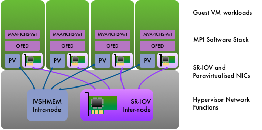
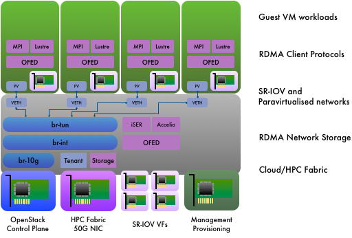
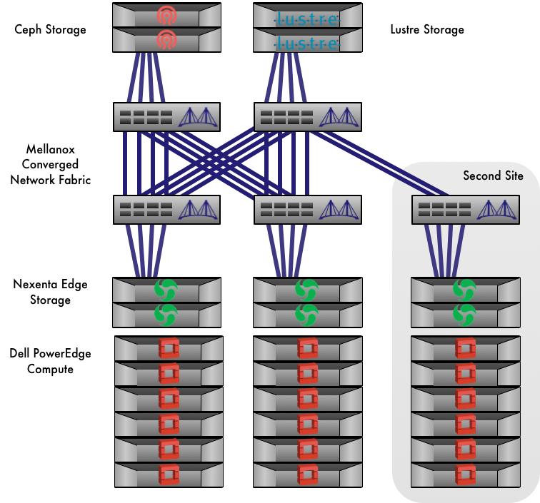

OpenStack and HPC Network Fabrics
#################################

HPC and cloud infrastructure are not built to the same requirements.
As much as anything else, networking exemplifies the divergent criteria
between HPC applications and the typical workloads served by cloud
infrastructure.

With sweeping generalisations, one typically assumes an HPC
parallel workload is tightly-coupled, and a cloud-native workload is
loosely-coupled.  A typical HPC parallel workload might be computational
fluid dynamics using a partitioned geometric grid.  The application
code is likely to be structured in a bulk synchronous parallel model,
comprising phases of compute and data exchange between neighbouring
workers.  Progress is made in lock-step, and is blocked until all workers
complete each phase.

Compare this with typical cloud-native application, which might be
a microservice architecture consisting of a number of communicating
sequential processes.  The overall application structure is completely
different, and workers do not have the same degree of dependency upon
other workers in order to make progress.

The different requirements of HPC and cloud-native applications have led
to different architectural choices being made at every level in order to
deliver optimal and cost-effective solutions for each target application.

A cloud environment experiences workload diversity to a far greater extent
than seen in HPC.  This has become the quintessential driving force of
software-defined infrastructure.  Cloud environments are designed to
be flexible and adaptable.  As a result, cloud infrastructure has the
flexibility to accommodate HPC requirements.

The flexibility of cloud infrastructure is delivered through layers
of abstraction.  OpenStack’s focus is on defining the intent of
the multi-tenant cloud infrastructure.  Dedicated network management
applications decide on the implementation.  As an orchestrator, OpenStack
delegates knowledge of physical network connectivity to the network
management platforms to which it connects.

OpenStack’s surging momentum has ensured that support already exists
for all but the most exotic of HPC network architectures.  This article
will describe several solutions for delivering HPC networking in an
OpenStack cloud.

Using SR-IOV for Virtualised HPC Networking
===========================================

SR-IOV is a technology that demonstrates how software-defined
infrastructure can introduce new flexibility in the management of HPC
resources, whilst retaining the high-performance benefits.  With current
generation devices, there is a slight increase in I/O latency when using
SR-IOV virtual functions.  However, this overhead is negligible for all
but the most latency-sensitive of applications.

The Process Flow for Using SR-IOV
---------------------------------

The Nova compute hypervisor is configured at boot time with kernel flags
to support extensions for SR-IOV hardware management.

The network kernel device driver is configured to create virtual
functions.  These are present alongside the physical function.  When they
are not assigned to a guest workload instance, the virtual functions
are visible in the device tree of the hypervisor.

The OpenStack services are configured with identifiers or addresses
of devices configured to support SR-IOV.  This is most easily done by
identifying the physical function (for example using its network device
name, PCI bus address, or PCI vendor/device IDs).  All virtual functions
associated with this device will be made available for virtualised
compute instances.  The configuration that identifies SR-IOV devices is
known as the whitelist.

To use an SR-IOV virtual function for networking in an instance,
a special direct-bound network port is created and connected with
the VM.  This causes one of the virtual functions to be configured and
passed-through from the hypervisor into the VM.

Support for launching an instance using SR-IOV network interfaces from
OpenStack’s Horizon web interface was introduced in the OpenStack
Mitaka release (April 2016).  Prior to this, it was only possible to
launch instances using SR-IOV ports through a sequence of command-line
invocations (or through direct interaction with the OpenStack APIs).

The Limitations of Using SR-IOV in Cloud Infrastructure
-------------------------------------------------------

SR-IOV places some limitations on the cloud computing model that can be
detrimental to the overall flexibility of the infrastructure:

* Current SR-IOV hardware implementations support flat (unsegregated)
  and VLAN network separation but not VXLAN for tenant networks.  This
  limitation can constrain the configuration options for the network fabric.
  Layer-3 IP-based fabrics using technologies such as ECMP are unlikely
  to interoperate with VLAN-based network separation.

* Live migration of VMs connected using SR-IOV is not possible with current
  hardware and software.  The capability is being actively developed for
  Mellanox SR-IOV NICs.  It is not confirmed whether live migration of
  RDMA applications will be possible.

* SR-IOV devices bypass OpenStack’s security groups, and consequently
  should only be used for networks that are not externally connected.

Virtualisation-aware MPI for Tightly-Coupled Cloud Workloads
============================================================

The MVAPICH2 library implements MPI-3 (based on MPI 3.1 standard)
using the IB verbs low-level message passing primitives.  MVAPICH2 was
created and developed by the `Network-Based Computing Laboratory
<http://nowlab.cse.ohio-state.edu/>`_ (NOWLAB) at The Ohio State
University, and has been freely available for download for 15 years.
Over that time MVAPICH2 has been continuously developed and now runs on
systems as big as 500,000 cores.

An Infiniband NIC with SR-IOV capability was first developed by Mellanox
in the ConnectX-3 generation of its product, unlocking the possibility
of achieving near-native Infiniband performance in a virtualised
environment.  MVAPICH2-Virt was introduced in 2015 to develop HPC levels
of performance for cloud infrastructure.  The techniques adopted by
MVAPICH2-Virt currently support KVM and Docker based cloud environments.
MVAPICH2-Virt introduces Inter-VM Shared Memory (IVSHMEM) support to KVM
hypervisors, increasing performance between co-resident VMs.  In order
to run MVAPICH2-Virt based applications on top of OpenStack-based cloud
environments easily, several extensions to set up SR-IOV and IVSHMEM
devices in VMs have been developed for OpenStack’s Nova compute manager.

MVAPICH2-Virt has two principal optimisation strategies for KVM-based
cloud environments:

* Dynamic locality awareness for MPI communication among co-resident
  VMs.  A new communication channel, IVSHMEM, introduces a memory-space
  communication mechanism between different VMs co-resident on the same
  hypervisor.  Inter-node communication continues to use the SR-IOV
  virtual function.
* Tuning of MPI performance for both SR-IOV and IVSHMEM channels.

Similarly, MVAPICH2-Virt has two principal optimisation strategies for
Docker based cloud environments:

* Dynamic locality awareness for MPI communication among co-resident
  containers. All Intra-Node MPI communication can go through either IPC-SHM
  enabled channel or CMA channel, no matter they are in the same container
  or different ones. Inter-Node-Inter-Container MPI communication will
  leverage the InfiniBand HCA channel.
* Tuning of MPI performance for all different channels, including IPC-SHM,
  CMA, and InfiniBand HCA.

With these strategies in effect, the performance overhead of KVM and
Docker based virtualisation on standard MPI benchmarks and applications
are less than 10%.

  "The novel designs introduced in MVAPICH2-Virt take advantage of the
  latest advances in virtualisation technologies and promise to design
  next-generation HPC cloud environments with good performance", says
  Prof. DK Panda and Dr. Xiaoyi Lu of NOWLAB.

  OpenStack as an environment for supporting MPI based HPC workloads  has
  many  benefits such as fast VM or container deployment for setting up
  MPI job execution environments, security, enabling resource sharing,
  providing privileged access in virtualized environments, supporting
  high-performance networking technologies (e.g. SR-IOV), etc

  Currently, OpenStack still could not fully support or work seamlessly
  with technologies in HPC environments, such as IVSHMEM, SLURM, PBS,
  etc. But with several extensions proposed by NOWLAB researchers, running
  MPI based HPC workloads on top of OpenStack managed environments seems
  a promising approach for building efficient clouds.

  The future direction of MVAPICH2-Virt includes

  * Further support different kinds of virtualised environments
  * Further improve MPI application performance on cloud environments
    through novel designs
  * Support live migration of MPI applications in SR-IOV and IVSHMEM enabled VMs

Infiniband and other Non-Ethernet Fabrics
=========================================

Infiniband is the dominant fabric interconnect for HPC clusters.  Of the
TOP500 list published in June 2016, 41% of entries use Infiniband.

In part, OpenStack’s flexibility comes from avoiding many rigid
assumptions in infrastructure management.  However, OpenStack networking
does have some expectations of an Ethernet and IP-centric network
architecture, which can present challenges for the network architectures
often used in HPC.  The Neutron driver for Infiniband circumvents this
assumption by applying Neutron’s layer-3 network configuration to an
IP-over-IB interface, and mapping Neutron’s layer-2 network segmentation
ID to Infiniband pkeys.

However, Neutron is limited to an allocation of 126 pkeys, which imposes
a restrictive upper limit on the number of distinct tenant networks an
OpenStack Infiniband cloud can support.

A technical lead with experience of using OpenStack on Infiniband reports
mixed experiences from an evaluation performed in 2015.  The overall
result led him to conclude that HPC fabrics such as Infiniband are
only worthwhile in an OpenStack environment if one is also using RDMA
communication protocols in the client workload:

  "MPI jobs were never a targeted application for our system.  Rather, the
  goal for our OpenStack was to accommodate all the scientific audiences
  for whom big HPC clusters, and batch job schedulers, weren't a best fit.
  So, no hard, fast requirement for a low-latency medium.  What we realized
  was that it's complex.  It may be hard to keep it running in production.
  IPoIB on FDR, in unconnected mode, is slower than 10Gbps Ethernet,
  and if you're not making use of RDMA, then you're really just kind of
  hurting yourself.  Getting data in and out is tricky.  All the big data
  we have is on a physically separate IB fabric, and no one wanted to span
  those fabrics, and doing something involving IP routing would break down
  the usefulness of RDMA."

IP-over-IB performance and scalability has improved substantially in
subsequent hardware and software releases.  A modern Infiniband host
channel adaptor with a current driver stack operating in connected mode
can sustain 35-40 Gbits/sec in a single TCP stream on FDR Infiniband.

The Canadian HPC4Health consortium have deployed a federation of OpenStack
private clouds using a Mellanox FDR Infiniband network fabric.

Intel’s Omnipath network architecture is starting to emerge in the
Scientific OpenStack community.  At Pittsburgh Supercomputer Center,
the BRIDGES system entered production in early 2016 for HPC and data
analytics workloads.  It comprises over 800 compute nodes with an
Omnipath fabric interconnect.  In its current product generation,
Omnipath does not support SR-IOV.  BRIDGES is a bare metal system,
managed using OpenStack Ironic.  The Omnipath network management is
managed independently of OpenStack.

BRIDGES is described in greater detail in the section OpenStack and HPC
Infrastructure Management.

An RDMA-Centric Bioinformatics Cloud at Cambridge University
============================================================

Cambridge University’s Research Computing Services group has a long
track record as a user of RDMA technologies such as Infiniband and
Lustre across all its HPC infrastructure platforms.  When scoping a new
bioinformatics compute resource in 2015, the desire to combine this
proven HPC technology with a flexible self-service platform led to a
requirements specification for an RDMA-centric OpenStack cloud.

Bioinformatics workloads can be IO-intensive in nature, and can also
feature IO access patterns that are highly sensitive to IO latency.
Whilst this class of workload is typically a weakness of virtualised
infrastructure, the effects are mitigated through use of HPC technologies
such as RDMA and virtualisation technologies such as SR-IOV to maximise
efficiency and minimise overhead.

The added complexity of introducing HPC networking technologies is
considerable, but remains hidden from the bioinformatics users of
the system.  Block-based IO via RDMA is delivered to the kernel of the
KVM hypervisor.  The compute instances simply see a paravirtualised
block device.  File-based IO via RDMA is delivered using the Lustre
filesystem client drivers running in the VM instances.  Through use
of SR-IOV virtual functions, this is identical to a bare metal compute
node in a conventional HPC configuration.  Similarly, MPI communication
is performed on the virtualised network interfaces with no discernable
difference for the user of the compute instance.

   *Software architecture of the compute node of an RDMA-centric 
   OpenStack cloud.*

The cloud contains 80 compute nodes, 3 management nodes and a number
of storage nodes of various kinds.  The system runs Red Hat OpenStack
Platform (OSP) and is deployed using Red Hat’s TripleO-based process.
All the HPC-centric features of the system have been implemented
using custom configuration and extensions to TripleO.  Post-deployment
configuration management is performed using Ansible-OpenStack playbooks,
resulting in a devops approach for managing an HPC system.

To deploy a system with RDMA networking enabled in the compute node
hypervisor, overcloud management QCOW2 images are created with OpenFabrics
installed.  Cinder is configured to use iSER (iSCSI Extensions for RDMA)
as a transport protocol.

The cloud uses a combination of Mellanox 50G Ethernet NICs and 100G
Ethernet switches for its HPC network fabric.  RDMA support using RoCEv1
requires layer-2 network connectivity.  Consequently OpenStack’s
networking is configured to use VLANs for control plane traffic and HPC
tenant networking.  VXLAN is used for other classes of tenant networking.

A multi-path layer-2 network fabric is created using multi-chassis LAGs.
Traffic is distributed across multiple physical links whilst presenting a
single logical link for the Ethernet network topology.  Port memberships
of the tenant network VLANs are managed dynamically using the NEO
network management platform from Mellanox, which integrates with
OpenStack Neutron.

The Forces Driving HPC and Cloud Diverge in Network Management
==============================================================

At the pinnacle of HPC, ultimate performance is achieved through
exploiting full knowledge of all hardware details: the microarchitecture
of a processor, the I/O subsystem of a server - or the physical location
within a network.  HPC network management delivers performance by enabling
workload placement with awareness of the network topology.

The cloud model succeeds because of its abstraction.  Cloud infrastructure
commits to delivering a virtualised flat network to its instances.
All details of the underlying physical topology are obscured.  Where an
HPC network management system can struggle to handle changes in physical
network topology, cloud infrastructure adapts.

OpenStack provides a limited solution to locality-aware placement, through
use of availability zones (AZ).  By defining an AZ per top-of-rack
switch, a user can request instances be scheduled to be co-resident
on the same edge switch.  However, this can be a clumsy interface for
launching instances on a large private cloud, and AZs cannot be nested
to provide multiple levels of locality for co-locating larger workloads.

OpenStack depends on other network management platforms for physical
network knowledge, and delegates to them all aspects of physical
network management.  Network management and monitoring packages such
as Observium and Mellanox NEO are complementary to the functionality
provided by OpenStack.

Another key theme in HPC network management is in gathering
network-centric performance telemetry.

While HPC does not deliver on all of its promise in this area, there is
greater focus within HPC network management on the ability to collect
telemetry data on the performance of a network for optimising the
workload.

Cloud and HPC take very different approaches in this sector.

In general, HPC performance monitoring is done at the application level.
HPC application performance analysis typically follows a model in which
runtime trace data is gathered during execution for later aggregation
and visualisation.  This approach avoids overhead when monitoring is
not required and minimises the overhead when monitoring is active.
When application monitoring is active, leading packages such as OVIS
minimise overhead by using RDMA for aggregation of runtime telemetry data.
Application performance visualisation is performed using tools such
as VAMPIR.  All these HPC-derived application performance monitoring
tools will also work for applications running within an OpenStack/HPC
environment.

At a system level, HPC network performance analysis is more limited in
scope, but developments such as PAVE at Lawrence Livermore and more
recently INAM^2 from Ohio State University are able to demonstrate
a more holistic capability to identify adverse interactions between
applications sharing a network, in addition to performance bottlenecks
within an application itself.

The pace of development of cloud infrastructure monitoring is
faster, and in many cases is derived from open-source equivalents of
hyperscaler-developed capabilities.  Twitter’s Zipkin is a distributed
application performance monitoring framework derived from conceptual
details from Google’s Dapper.  LinkedIn developed and published
Kafka, a distributed near-real-time message log.  However, the layers of
abstraction that give cloud its flexibility can prevent cloud monitoring
from providing performance insights from the physical domain that inform
performance in the virtual domain.

At OpenStack Paris in November 2014 Intel demonstrated Apex Lake,
a project which aims to provide performance telemetry across these
abstraction boundaries - including across virtual/physical network
abstractions.  Some of these features may have been incorporated into
the Intel’s open source Snap telemetry/monitoring framework.

In its present situation, through use of SR-IOV network devices,
cloud network infrastructure has demonstrated that it is capable at
achieving performance levels that are typically within 1-9% of bare metal.
OpenStack can be viewed as the integration and orchestration of existing
technology platforms.  The physical network performance telemetry of
cloud network infrastructure is delegated to the technology platforms
upon which it is built.  In future, projects such as INAM^2 on the HPC
side and Apex Lake on the cloud side may lead to a telemetry monitoring
framework capable of presenting performance data from virtual and physical
domains in the context of one another.

Further Reading
===============

This Intel white paper provides a useful introduction to SR-IOV:
http://www.intel.in/content/dam/doc/white-paper/pci-sig-single-root-io-virtualization-support-in-virtualization-technology-for-connectivity-paper.pdf

A step-by-step guide to setting up Mellanox Infiniband
with a Red Hat variant of Linux and OpenStack Mitaka:
https://wiki.openstack.org/wiki/Mellanox-Neutron-Mitaka-Redhat-InfiniBand

A presentation by Professor DK Panda from NOWLAB at Ohio State University
on MVAPICH2-Virt: https://youtu.be/m0p2fibwukY

Further information on MVAPICH2-Virt can be found here:
http://mvapich.cse.ohio-state.edu

Some papers from the team at NOWLAB describing MVAPICH2-Virt in greater depth:

* [HiPC'14] High Performance MPI Library over SR-IOV Enabled InfiniBand Clusters.
  Jie Zhang, Xiaoyi Lu, Jithin Jose, Rong Shi, Mingzhe Li, and Dhabaleswar
  K. (DK) Panda.  Proceedings of the 21st annual IEEE International
  Conference on High Performance Computing (HiPC), 2014.
* [CCGrid'15] MVAPICH2 over OpenStack with SR-IOV: An Efficient Approach
  to Build HPC Clouds. Jie Zhang, Xiaoyi Lu, Mark Arnold, and Dhabaleswar 
  K. (DK) Panda.  Proceedings of the 15th IEEE/ACM International Symposium
  on Cluster, Cloud and Grid Computing (CCGrid), 2015.

The OVIS HPC application performance monitoring framework:
https://ovis.ca.sandia.gov/mediawiki/index.php/Main_Page

PAVE - Performance Analysis and Visualisation
at Exascale at Lawrence Livermore:
http://computation.llnl.gov/projects/pave-performance-analysis-visualization-exascale

The introduction of INAM^2 for real-time
Infiniband network performance monitoring:
http://mvapich.cse.ohio-state.edu/static/media/publications/abstract/subramoni-isc16-inam.pdf

Further information on INAM^2 can be found here:
http://mvapich.cse.ohio-state.edu/tools/osu-inam/

Open Zipkin is a distributed application performance monitoring framework
developed at Twitter, based on Google’s paper their Dapper monitoring
framework: http://zipkin.io

Intel Snap is a new monitoring framework for virtualised infrastructure:
http://snap-telemetry.io

Observium is a network mapping and monitoring platform built upon SNMP:
http://observium.org/

A useful discussion on the value of high-resolution network telemetry
for researching issues with maximum latency in a cloud environment:
https://engineering.linkedin.com/performance/who-moved-my-99th-percentile-latency

Acknowledgements
================

This document was originally written by Stig Telfer of `StackHPC Ltd <https://www.stackhpc.com>`_ with the support
of Cambridge University, with contributions, guidance and feedback from
subject matter experts:

* **Professor DK Panda** and **Dr. Xiaoyi Lu** from NOWLAB, Ohio State University.
* **Jonathan Mills** from NASA Goddard Spaceflight Center.

.. figure:: images/cc-by-sa.png
   :width: 100
   :alt: Creative commons licensing

   This document is provided as open source with a Creative Commons license
   with Attribution + Share-Alike (CC-BY-SA)
