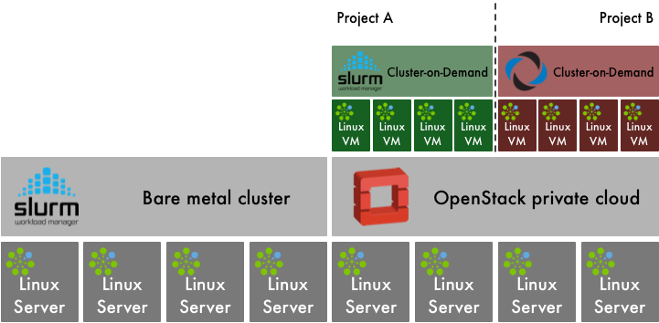
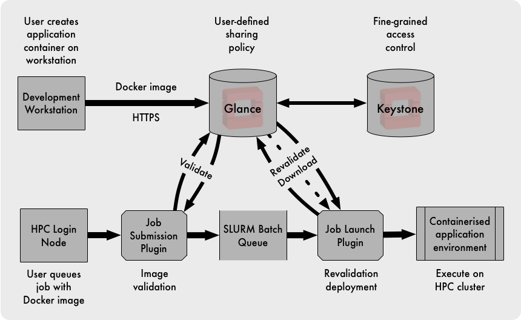

OpenStack and HPC Workload Management
#####################################

Workload Management in HPC and Cloud
====================================

The approach taken for managing workloads is a major difference between
conventional use cases of HPC and cloud.

A conventional approach to HPC workload management is likely to involve
one or more head nodes of an HPC cluster for login, development,
compilation and job submission services.  Parallel workloads would
be submitted from a head node to job batch queues of the workload
manager, which control access to parallel partitions of compute nodes.
Such partitions may equate to mappings of types of compute nodes and the
specific resources (CPU, memory, storage and networking) that applications
require.  Each compute node runs a workload manager agent which configures
resources, launches application processes and monitors utilisation.

Pain Points in Conventional HPC Workload Management
---------------------------------------------------

On a large multi-user HPC system the login node is a continual source
of noisy neighbour problems.  Inconsiderate users may, for example,
consume system resources by performing giant compilations with wide
task parallelism,  open giant logfiles from their task executions,
or run recursive finds across the filesystem to look for forgotten files.

An HPC system must often support a diverse mix of workloads.  Different
workloads may have a wide range of dependencies.  With increasing
diversity comes an increasing test matrix, which increases the toil
involved in making any changes.  How can an administrator be sure of the
effects of any change to the software packages installed?  What must
be done to support a new version of an ISV application?  What are the
side-effects of updating the version of a dependency?  What if a security
update leads to a dependency conflict?  As the flexibility of an HPC
software environment grows, so too does the complexity maintaining it.

In an environment where data is sensitive, local scratch space and
parallel filesystems for HPC workloads can often have default access
permissions with an undesirable level of openness.  Data security can be
problematic in a shared HPC resource in which the tenants are not trusted.

The Case for Workload Management on OpenStack Infrastructure
------------------------------------------------------------

The flexibility of OpenStack can ease a number of pain points of HPC
cluster administration:

* With software-defined OpenStack infrastructure, a new compute node or
  head node is created through software processes - not a trip to the
  data centre.  Through intelligent orchestrated automated provisioning,
  the administrative burden of managing changes to resource configuration
  can be eliminated.  And from a user’s perspective, a self-service
  process for resizing their resource allocation is much more responsive
  and devolves control to the user.
* Through OpenStack it becomes a simple process to automatically provision
  and manage any number of login nodes and compute nodes.  The multi-tenancy
  access control of cloud infrastructure ensures that compute resources
  allocated to a project are only seen and accessible to members of that
  project.  OpenStack does not pretend to change the behaviour of noisy
  neighbours, but it helps to remove the strangers from a neighbourhood.
* OpenStack’s design ethos is the embracing (not replacing) of data
  centre diversity.  Supporting a diverse mix of HPC workloads is not
  materially different from supporting the breadth of cloud-native
  application platforms.  One of the most significant advances of cloud
  computing has been in the effective management of software images.  Once a
  user project has dedicated workload management resources allocated to it,
  the software environment of those compute resources can be tailored to
  the specific needs of that project without infringing on any conflicting
  requirements of other users.
* The cloud multi-tenancy implemented by OpenStack enforces segregation
  so that tenants are only visible to one another through the interfaces
  that they choose to expose.  The isolation of tenants applies to all
  forms of resources - compute, networking and storage.  The fine-grained
  control over what is shared (and what is not shared) results in greater
  data security than a conventional multi-user HPC system.

All of this can be done using conventional HPC infrastructure and
conventional management techniques, but to do so would demand using
industry best practices as a baseline, and require the continual
attention of a number of competent system administrators to keep it
running smoothly, securely and to the satisfaction of the users.

Organisations working on the convergence of HPC and cloud often refer
to this subject as cluster-as-a-service.  How can a cloud resource
be equipped with the interfaces familiar to users of batch-queued
conventional HPC resources?

Delivering an HPC Platform upon OpenStack Infrastructure
========================================================

HPC usually entails a platform, not an infrastructure.  How is OpenStack
orchestrated to provision an HPC cluster and workload manager?

Addressing this market are proprietary products and open source projects.
The tools available in the OpenStack ecosystem also ensure that a
home-grown cluster orchestration solution is readily attainable.
An example of each approach is included here.

Broadly the cluster deployment workflow would follow these steps:

#. The creation of the HPC cluster can be instigated through the command
   line.  In some projects a custom panel for managing clusters is added
   to Horizon the OpenStack web dashboard.
#. Resources for the cluster must be allocated from the OpenStack
   infrastructure.  Compute node instances, networks, ports, routers,
   images and volumes must all be assigned to the new cluster.
#. One or more head nodes must be deployed to manage the cluster node
   instances, provide access for end users and workload management.
   The head node may boot a customised image (or volume snapshot) with
   the HPC cluster management software installed.  Alternatively, it may
   boot a stock cloud image and install the required software packages as
   a secondary phase of deployment.
#. Once the head nodes are deployed with base OS and HPC cluster
   management packages, an amount of site-specific and deployment-specific
   configuration must be applied.  This can be applied through instance
   metadata or a configuration management language such as Ansible or Puppet.
   A Heat-orchestrated deployment can use a combination of instance metadata
   and a configuration management language (usually Puppet but more recently
   Ansible provides such capability).
#. A number of cluster node instances must be deployed.  The process of
   node deployment can follow different paths.  Typically the cluster nodes
   would be deployed in the same manner as the head nodes by booting from
   OpenStack images or volumes, and applying post-deployment configuration.
#. The head nodes and cluster nodes will share one or more networks, and
   the cluster nodes will register with the HPC workload management service
   deployed on the head nodes.

Open Platforms for Cluster-as-a-Service
---------------------------------------

The simplest implementation is arguably ElastiCluster, developed and
released as GPL open source by a research computing services group at
the University of Zurich.  ElastiCluster supports OpenStack, Google
Compute Engine and Amazon EC2 as back-end cloud infrastructure, and
can deploy (among others) clusters offering SLURM, Grid Engine, Hadoop,
Spark and Ceph.

ElastiCluster is somewhat simplistic and its capabilities are
comparatively limited.  For example, it doesn't currently support Keystone
v3 authentication - a requirement for deployments where a private
cloud is divided into a number of administrative domains.  A cluster
is defined using an INI-format configuration template.  When creating
a SLURM cluster, virtual cluster compute nodes and a single head node
are provisioned as VMs from the OpenStack infrastructure.  The compute
nodes are interconnected using a named OpenStack virtual network.
All post-deployment configuration is carried out using Ansible playbooks.
The head node is a SLURM controller, login node and NFS file server for
/home mounting onto the compute nodes.

Trinity from ClusterVision uses OpenStack to manage bare metal
infrastructure, and creates a dynamic HPC-as-a-Service platform comprising
SLURM workload management and Docker containers (running on bare metal)
for the virtual cluster compute nodes.  Management of virtual clusters is
more user-friendly in Trinity than in ElastiCluster.  A custom panel has
been added to the OpenStack Horizon dashboard to enable users to create,
manage and monitor their virtual clusters.

Trinity is developed as open source, but has a very small group of
developers.  The ‘bus factor’ of this project has been exposed by
the recent departure from ClusterVision of Trinity’s core contributor.

Bright Computing Cluster-on-Demand
----------------------------------

Bright Computing has developed its proprietary products for HPC
cluster management and adapted them for installation, configuration and
administration of OpenStack private clouds.  The product is capable of
partitioning a system into a mix of bare metal HPC compute and OpenStack
private cloud.

Bright Computing also provides an OpenStack distribution with
Bright-themed OpenStack web interface and an additional panel for
management of Cluster-on-Demand deployments.

Cluster-on-Demand uses OpenStack Heat for orchestrating the allocation and
provisioning of virtualised cluster resources.  When a virtual cluster is
created, the Nova flavors (virtualised hardware templates) for head node
and cluster compute node are specified.  OpenStack networking details
are also provided.  Bright OpenStack is capable of deploying OpenStack
with SR-IOV support, and Cluster-on-Demand is capable of booting cluster
compute nodes with SR-IOV networking.

Cluster-on-Demand deployment begins with pre-built generic head
node images.  Those can then be quickly instantiated (via optional
copy-on-write semantics) and automatically customized to user’s
requirements.  Bright’s deployment solution differs slightly from other
approaches by using Bright Cluster Manager on the virtualised head node
to deploy the virtual cluster nodes as though they were bare metal.
This approach neatly nests the usage model of Bright Cluster Manager
within a virtualised environment, preserving the familiar workflow of
bare metal deployment.  However, as a result it does not exploit the
efficiencies of cloud infrastructure for compute node deployment at scale.
A virtualised cluster of “typical” size can be deployed on-demand from
scratch in several minutes, at which point it is ready to accept HPC jobs.

Bright provide configurations for a wide range of workload managers, big
data services (Spark, Hadoop), deep learning tools, or even virtualised
OpenStack clouds (OpenStack on OpenStack).  Bright Cluster-on-Demand
can also dynamically burst to public clouds (AWS) when more resources
are needed (e.g. GPU nodes) or during heavy load spikes.

Cluster-on-Demand focuses on delivering the flexibility advantages of
self-service cluster provisioning, but can also deliver performance with
minimised virtualisation overhead through use of SR-IOV.

A distinctive feature of Bright OpenStack is the ability to easily deploy
virtualised HPC compute nodes next to physical ones, and run HPC workloads
in an environment spanning mixture of physical and virtual compute nodes.
Doing so provides the admin with a whole new level of flexibility.
For example, it allows the assignment of high priority HPC job queues
to physical compute nodes, and low priority job queues, or long running
jobs, to virtual compute nodes.  This in turn allows the VMs to be
live migrated across the datacentre (e.g. due to hardware maintenance)
without impacting the long-running HPC jobs hosted on them.

Extending SLURM and OpenStack to Orchestrate MVAPICH2-Virt Configuration
------------------------------------------------------------------------

The NOWLAB group at Ohio State University has developed a virtualised
variant of their MPI library, MVAPICH2-Virt.  MVAPICH2-Virt is described
in greater detail in the section OpenStack and HPC Network Fabrics.

NOWLAB has also developed plugins for SLURM, called SLURM-V, to extend
SLURM with virtualization-oriented capabilities such as submitting jobs to
dynamically created VMs with isolated SR-IOV and inter-VM shared memory
(IVSHMEM) resources.  Through MVAPICH2-Virt runtime, the workload is
able to take advantage of the configured SR-IOV and IVSHMEM resources
efficiently.  The NOWLAB model is slightly different from the approach
taken in Cluster-as-a-Service, in that a MVAPICH2-Virt based workload
launches into a group of VMs provisioned specifically for that workload.

  "The model we chose to create VMs for the lifetime of each job seems
  a clear way of managing virtualized resources for HPC workloads. This
  approach can avoid having long-lived VMs on compute nodes, which makes
  the HPC resources always in the virtualised state. Through the SLURM-V
  model, both bare-metal and VM based jobs can be launched on the same set
  of compute nodes since the VMs are provisioned and configured dynamically
  only when the jobs need virtualised environments", says Prof. DK Panda
  and Dr. Xiaoyi Lu of NOWLAB.

The IVSHMEM component runs as a software device driver in the host kernel.
Every parallel workload has a separate instance of the IVSHMEM device
for communication between co-resident VMs.  The IVSHMEM device is mapped
into the workload VMs as a paravirtualised device.  The NOWLAB team has
developed extensions to Nova to add the connection of the IVSHMEM device
on VM creation, and recover the resources again on VM deletion.

Users can also hotplug/unplug the IVSHMEM device to/from specified
running virtual machines. The NOWLAB team provides a tool with
MVAPICH2-Virt (details can be found in the `MVAPICH2-Virt userguide
<http://mvapich.cse.ohio-state.edu/userguide/virt/#_support_for_integration_with_openstack_for_vms>`_)
to hotplug an IVSHMEM device to a virtual machine and unplug an IVSHMEM
device from a virtual machine.

The SLURM-V extensions have been developed to work with KVM directly.
However, the NOWLAB group have extended their project to enable SLURM-V
to make OpenStack API calls to orchestrate the creation of workload VMs.
In this model of usage, SLURM-V uses OpenStack to allocate VM instances,
isolate networks and attach SR-IOV and IVSHMEM devices to workload VMs.
OpenStack has already provided scalable and efficient mechanisms for
creation, deployment, and reclamation of VMs on a large number of
physical nodes.

SLURM-V is likely to be one of many sources competing for
OpenStack-managed resources.  If other cloud users consume all resources,
leaving SLURM-V unable to launch sufficient workload VMs, then the new
submitted jobs will be queued in SLURM to wait for available resources.
As soon as one job completes and the corresponding resources are
reclaimed, SLURM will find another job in the queue to execute based on
the configured scheduling policy and resource requirements of jobs.

Combining the Strengths of Cloud with HPC Workload Management
-------------------------------------------------------------

At Los Alamos National Lab, there is a desire to increase the flexibility
of the user environment of their HPC clusters.

To simplify their workload, administrators want every software image
to be the same, everywhere.  LANL systems standardise on a custom
Linux distribution, based on Red Hat 6 and tailored for their demanding
requirements.  Sustaining the evolution of that system to keep it current
with upstream development whilst maintaining local code branches is an
ongoing challenge.

The users demand ever increasing flexibility, but have requirements
that are sometimes contradictory.  Some users have applications with
complex package dependencies that are out of date or not installed in
the LANL distribution.  Some modern build systems assume internet access
at build time, which is not available on LANL HPC clusters.  Conversely,
some production applications are built from a code base that is decades
old, and has dependencies on very old versions of libraries.  Not all
software updates are backwards compatible.

Tim Randles, a senior Linux administrator and OpenStack architect at the
Lab, uses OpenStack and containers to provide solutions.  Woodchuck is
LANL’s third-generation system aimed at accommodating these conflicting
needs.  The 192-node system has a physical configuration optimised for
data-intensive analytics: a large amount of RAM per CPU core, local disk
for scratch space for platforms such as HDFS and 10G Ethernet with VXLAN
and SDN capabilities for virtualised networking.

Reid Priedhorsky at LANL has developed an unprivileged containerised
runtime environment, dubbed “Charliecloud”, upon which users can
run applications packaged using Docker tools.  This enables users to
develop and build their packages on their (comparatively open) laptops
or workstations, pulling in the software dependencies they require.

One issue arising from this development cycle is that in a
security-conscious network such as LANL, the process of transferring
application container images to the HPC cluster involves copying large
amounts of data through several hops.  This process was soon found to
have drawbacks:

* It quickly became time-consuming and frustrating.
* It could not be incorporated into continuous integration frameworks.
* The application container images were being stored for long periods of
  time on Lustre-backed scratch space, which has a short data retention
  policy, was occasionally unreliable and not backed up.

Tim’s solution was to use OpenStack Glance as a portal between the
user’s development environment on their workstation and the HPC cluster.
Compared with the previous approach, the Glance API was accessible from
both the user’s workstations and the HPC cluster management environment.
The images stored in Glance were backed up, and OpenStack’s user model
provided greater flexibility than traditional Unix users and groups,
enabling fine-grained control over the sharing of application images.

Tim developed SLURM plugins to interact with Glance for validating the
image and the user’s right to access it.  When the job was scheduled for
execution, user and image were both revalidated and the application image
downloaded and deployed ready for launch in the Charliecloud environment.

Future plans for this work include using Neutron to create and manage
virtual tenant networks for each workload, and releasing the plugins
developed as open source contributions to SLURMs codebase.

HPC and Cloud Converge at the University of Melbourne
-----------------------------------------------------

Research compute clusters are typically designed according to the demands
of a small group of influential researchers representing an ideal use
case.  Once built, however, the distribution of use cases can change as
a broader group of researchers come onboard.  These new uses cases may
not match the expected ideal, and in some cases conflict.  If job queues
and computation times stretch out, it can drive the proliferation of
isolated department-level clusters which are more expensive to maintain,
lack scale, and are all too often orphaned when the responsible researcher
moves on.

Introducing Spartan
~~~~~~~~~~~~~~~~~~~

In 2016 the University of Melbourne launched a new cluster called Spartan.
It takes an empirical approach, driven by the job profiles observed in
its predecessor, Edward, in the prior year.  In particular, single-core
and low memory jobs dominate; 76% of were single core, and 97% used <4
GB of memory.  High-core count, task-parallel jobs were often delayed
due to competition with these single core jobs, leading to research
funds being directed towards department level resources.  National peak
facilities were often rejected as an option due to their long queue
times and restrictive usage requirements.

Spartan takes advantage of the availability of an existing and very large
research cloud (NeCTAR) to allow additional computation capacity, and
the provisioning of common login and management infrastructure.  This is
combined with a small but more powerful partition of tightly coupled
bare-metal compute nodes, and specialist high-memory and GPU partitions.

This hybrid arrangement offers the following advantages:

* Users with data parallel jobs have access to the much larger research
  cloud and can soak up the spare cycles available with cloud bursting,
  reducing their job wait time.
* Users with task parallel jobs have access to optimised bare-metal HPC,
  supported by high-speed networking and storage.
* The larger task parallel jobs remain segregated from less
  resource-intensive data parallel jobs, reducing contention.
* Job demands can be continually monitored, and the cloud and bare metal
  partitions selectively expanded as and when the need arises.
* Departments and research groups can co-invest in Spartan.  If they need
  more processing time or a certain type of hardware, they can attach it
  directly to Spartan and have priority access. This avoids the added
  overheads of administering their own system, including the software
  environment, login and management nodes.
* Management nodes can be readily migrated to new hardware, allowing us
  to upgrade or replace hardware without bringing the entire cluster down.
* Spartan can continue beyond the life of its original hardware, as
  different partitions are resized or replaced, a common management and
  usage platform remains.

Spartan does not have extraordinary hardware or software, and it’s
peak performance does not exceed that of other HPC systems.  Instead,
it seeks to segregate compute loads into partitions with different
performance characteristics according to their demands.  This will
result in shorter queues, better utilisation, cost-effectiveness, and,
above all, faster time to results for our research community.

Job and Resource Management
~~~~~~~~~~~~~~~~~~~~~~~~~~~

Previous HPC systems at the University utilised Moab Workload Manager
for job scheduling and Terascale Open-source Resource and QUEue Manager
(TORQUE) as a resource manager.  The Spartan team adopted the SLURM
Workload Manager for the following reasons:

* Existing community of users at nearby Victorian Life Sciences Compute
  Initiative (VLSCI) facility.
* Similar syntax to the PBS scripts used on Edward, simplifying user
  transition.
* Highly configurable through add-on modules.
* Importantly, support for cloud bursting, for example, to the Amazon
  Elastic Computing Cloud (EC2) or, in Spartan's case, the NeCTAR research
  cloud.

Account Management
~~~~~~~~~~~~~~~~~~

Integration with a central staff and student Active Directory was
initially considered, but ultimately rejected due to the verbose usernames
required (i.e. email addresses).  The Spartan team reverted to using
an LDAP-based system as had been the case with previous clusters, and
a custom user management application.

Application Environment
~~~~~~~~~~~~~~~~~~~~~~~

EasyBuild was used as a build and installation framework, with the LMod
environmental modules system selected to manage application loading by
users.  These tools tightly integrate, binding the specific toolchains
and compilation environment to the applications loaded by users.
EasyBuild's abstraction in its scripts sometimes required additional
administrative overhead, and not all software had a pre-canned script
ready for modification, necessitating them to be built from scratch.

Training
~~~~~~~~

Training been a particular focus for the implementation of Spartan.
Previous HPC training for researchers was limited, with only 38
researcher/days of training conducted in the 2012-2014 period.
The Spartan team now engage in weekly training, rotating across the
following sessions:

* Introductory, targeting researchers with little or no HPC or Linux
  experience.
* Transition, targeting existing Edward users who need to port their jobs
  to Spartan.
* Shell scripting.
* Parallel programming.

The team collaborate closely with researchers to drive this curriculum,
serving a range of experience levels, research disciplines, and software
applications.

The Future
~~~~~~~~~~

Bernard Meade, Spartan project sponsor, adds:

  “The future configuration of Spartan will be driven by how it is
  actually used.  We continue to monitor what applications are run,
  how long they take, and what resources they require.  While Spartan
  has considerable elasticity on the cloud side, we’re also able to
  incrementally invest in added bare-metal and specialist nodes (high
  memory, GPU) as the need arises.  Given the diversity in HPC job
  characteristics will only grow, we believe this agile approach is the
  best means to serve the research community.”

Cloud Infrastructure Does Not (yet) Provide All the Answers
===========================================================

OpenStack Control Plane Responsiveness and Job Startup
------------------------------------------------------

Implementations of HPC workload management that create new VMs for worker
nodes for every job in the batch queue can have consequential impact
on the overall utilisation of the system if the jobs in the queue are
comparatively short-lived:

* Job startup time can be substantially increased.  A fast boot for a VM
  could is of the order of 20 seconds.  Similarly, job cleanup time can
  add more overhead while the VM is destroyed and its resources harvested.
* A high churn of VM creation and deletion can add considerable load to
  the OpenStack control plane.

The Cluster-as-a-Service pattern of virtualised workload managers does
not typically create VMs for every workload.  However, the OpenStack
control plane can still have an impact on job startup time, for example
if the application image must be retrieved and distributed, or a virtual
tenant network must be created.  Empirical tests have measured the time
to create a virtual tenant network to grow linearly with the number of
ports in the network, which could have an impact on the startup time
for large parallel workloads.

Workload Managers Optimise Placement Decisions
----------------------------------------------

A sophisticated workload manager can use awareness of physical network
topology to optimise application performance through placing the workload
on physical nodes with close network proximity.

On a private cloud system such as OpenStack, the management of
the physical network is delegated to a network management platform.
OpenStack avoids physical network knowledge and focuses on defining the
intended state, leaving physical network management platforms to apply
architecture-specific configuration.

In a Cluster-as-a-Service use case, there are two scheduling operations
where topology-aware placement could be usefully applied:

* When the virtual cluster compute node instances are created, their
  placement is determined by the OpenStack Nova scheduler.
* When a queued job in the workload manager is being allocated to virtual
  cluster compute nodes.

Through use of Availability Zones, OpenStack Nova can be configured to
perform a simple form of topology-aware workload placement, but without
any hierarchical grouping of nodes.  Nova’s scheduler filter API
provides a mechanism which could be used for implementing topology-aware
placement in a more intelligent fashion.

OpenStack’s Flexibility is Stretched by the Economics of Utilisation
--------------------------------------------------------------------

With its decoupled execution model, batch queue job submission is an
ideal use case for off-peak compute resources.  The AWS spot market
auctions time on idle cores for opportunistic usage at up to a 90%
discount from the on-demand price.

There is no direct equivalent to the AWS spot market in OpenStack.
More generally, management of pricing and billing is considered outside of
OpenStack’s scope.  OpenStack does not currently have the capabilities
required for supporting opportunistic spot usage.

However, work is underway to implement the software capabilities
necessary for supporting preemptible spot instances, and it is hoped
that OpenStack will support this use case in due course.  At that point,
Cluster-as-a-Service deployments could grow or shrink in response to
the availability of under-utilised compute resources on an OpenStack
private cloud.

The Difficulty of Future Resource Commitments
---------------------------------------------

HPC facilities possess a greater degree of oversight and coordination,
enabling users to request exclusive advance reservations of large sections
of an HPC system to perform occasional large-scale workloads.

In private cloud, there is no direct mainstream equivalent to this.
However, the Blazar project aims to extend OpenStack compute with support
for resource reservations.  Blazar works by changing the management
of resource allocation for a segregated block of nodes.  Within the
partition of nodes allocated to Blazar, resources can only be managed
through advance reservations.

A significant drawback of Blazar is that it does not support the
intermingling of reservations with on-demand usage.  Without the ability
to gracefully preempt running instances, Blazar can only support advance
reservations by segregating a number of nodes exclusively for that mode
of usage.

Summary
=======

OpenStack delivers new capabilities to flexibly manage compute clusters
as on-demand resources.  The ability to define a compute cluster
and workload manager through code, data and configuration plays to
OpenStack’s strengths.

With the exception of some niche high-end requirements, OpenStack can
be configured to deliver Cluster-as-a-Service with minimal performance
overhead compared with a conventional bare metal HPC resource.

Further Reading
===============

The ElastiCluster project from University of Zurich is
open source.  Online documentation is available here:
https://elasticluster.readthedocs.io/en/latest/index.html

The Trinity project from ClusterVision is developed as open source:
http://clustervision.com/solutions/trinity/

Bright Computing presented their proprietary
Bright OpenStack and Cluster-as-a-Service products
at the OpenStack Austin summit in April 2016:
https://www.openstack.org/videos/video/bright-computing-high-performance-computing-hpc-and-big-data-on-demand-with-cluster-as-a-service-caas

The NOWLAB’s publication on Slurm-V: Extending Slurm
for Building Efficient HPC Cloud with SR-IOV and IVShmem:
http://link.springer.com/chapter/10.1007/978-3-319-43659-3_26

Tim Randles from Los Alamos presented his work on
integrating SLURM with Glance on the HPC/Research speaker
track at the OpenStack Austin summit in April 2016:
https://www.openstack.org/videos/video/glance-and-slurm-user-defined-image-management-on-hpc-clusters

The Spartan OpenStack/HPC system at the University of Melbourne:
http://newsroom.melbourne.edu/news/new-age-computing-launched-university-melbourne
http://insidehpc.com/2016/07/spartan-hpc-service/

Topology-aware placement in SLURM is described here:
http://slurm.schedmd.com/topology.html

Some research describing a method of adding
topology-aware placement to the OpenStack Nova scheduler:
http://charm.cs.illinois.edu/newPapers/13-01/paper.pdf

HPC resource management at CERN and some current
OpenStack pain points are described in detail here:
http://openstack-in-production.blogspot.co.uk/2016/04/resource-management-at-cern.html

OpenStack Pre-emptible Instances Extension (OPIE) from Indigo Datacloud
is available here: https://github.com/indigo-dc/opie

Acknowledgements
================

This document was originally written by Stig Telfer of `StackHPC Ltd <https://www.stackhpc.com>`_ with the support
of Cambridge University, with contributions, guidance and feedback from
subject matter experts:

* **Piotr Wachowicz**, Cloud Integration Lead at Bright Computing
* **Professor DK Panda** and **Dr. Xiaoyi Lu** from NOWLAB, Ohio State University.
* **Tim Randles** from Los Alamos National Laboratory.
* **Lev Lafayette**, **Bernard Meade**, **David Perry**, **Greg Sauter**
  and **Daniel Tosello** from the University of Melbourne.

   This document is provided as open source with a Creative Commons license
   with Attribution + Share-Alike (CC-BY-SA)
