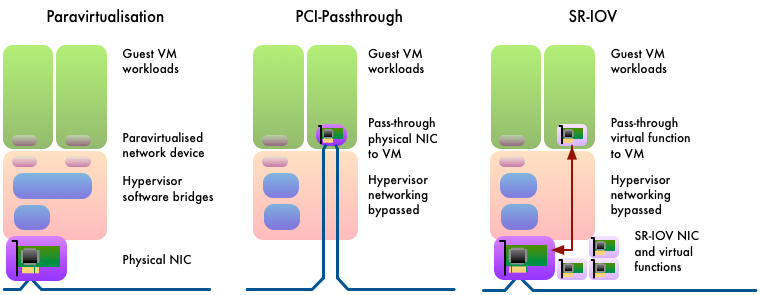
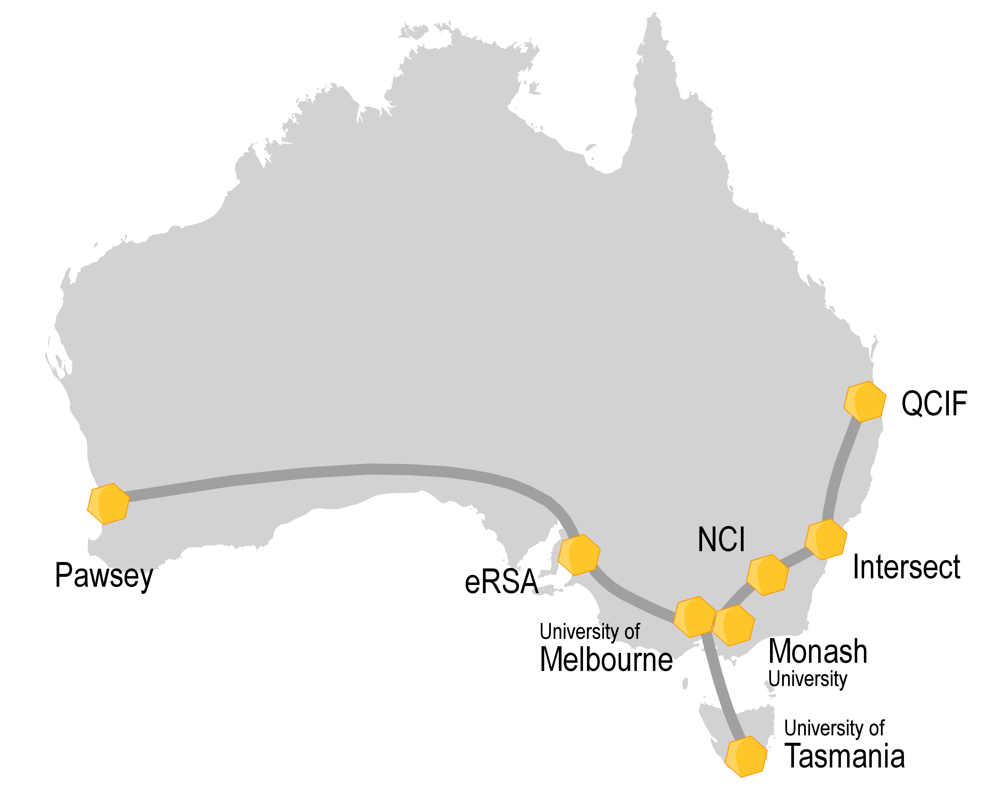
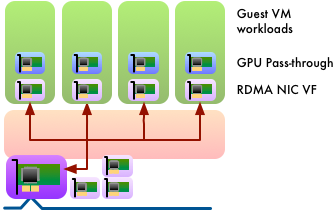

OpenStack and Virtualised HPC
#############################

Likely doubts over the adoption of OpenStack centre around the impact
of infrastructure virtualisation. From the skeptical perspective of an
HPC architect, why OpenStack?

* *I have heard the hype*
* *I am skeptical to some degree*
* *I need evidence of benefit*

In this section, we will describe the different forms of overhead that
can be introduced by virtualisation, and provide technical details
of solutions that mitigate, eliminate or bypass the overheads of
software-defined infrastructure.

The Overhead of Virtualisation
==============================

Analysis typically shows that the overhead of virtualisation for
applications that are CPU or memory intensive is minimal.

Similarly, applications that depend on high-bandwidth I/O or network
communication for bulk data transfers can achieve levels of performance
that are close to equivalent bare metal configurations.

Where a significant performance impact is observed, it can often be
ascribed to overcommitment of hardware resources or “noisy neighbours”
- issues that could equally apply in non-virtualised configurations.

However, there remains a substantial class of applications whose
performance is significantly impacted by virtualisation.  Some of the
causes of that performance overhead are described here.

Increased Software Overhead on I/O Operations
---------------------------------------------

Factors such as storage IOPs and network message latency are often
critical for HPC application performance.

HPC applications that are sensitive to these factors are poor performers
in a conventional virtualised environment.  Fully-virtualised environments
incur additional overhead per I/O operation that can impact performance
for applications that depend on such patterns of I/O.

The additional overhead is mitigated through paravirtualisation, in
which the guest OS includes support for running within a virtualised
environment.  The guest OS cooperates with the host OS to improve
the overhead of hardware device management.  Direct hardware device
manipulation is performed in the host OS, keeping the micro-management
of hardware closer to the physical device.  The hypervisor then presents
a more efficient software interface to a simpler driver in the guest OS.
Performance improves through streamlining interactions between guest OS
and the virtual hardware devices presented to it.

Hardware Offload in a Virtualised Network
-----------------------------------------

All modern Ethernet NICs provide hardware offload of IP, TCP and
other protocols.  To varying degrees, these free up CPU cycles from the
transformations necessary between data in user buffers and packets on
the wire (and vice versa).

In a virtualised environment, the network traffic of a guest VM passes
from a virtualised network device into the software-defined network
infrastructure running in the hypervisor.  Packet processing is usually
considerably more complex than a typical HPC configuration.  Hardware
offload capabilities are often unable to operate or are ineffective
in this mode.  As a result, networking performance in a virtualised
environment can be less performant and more CPU-intensive than an
equivalent bare metal environment.

Increased Jitter in Virtualised Network Latency
-----------------------------------------------

To varying degrees, virtualised environments generate increased system
noise effects.  These effects result in a longer tail on latency
distribution for interrupts and I/O operations.

A bulk synchronous parallel workload, iterating in lock-step, moves at
the speed of the slowest worker.  If the slowest worker is determined
by jitter effects in I/O latency, overall application progress becomes
affected by the increased system noise of a virtualised environment.

Using OpenStack to Deliver Virtualised HPC
==========================================

There is considerable development activity in the area of virtualisation.
New levels of performance and capability are continually being introduced
at all levels: processor architecture, hypervisor, operating system and
cloud orchestration.

Best Practice for Virtualised System Performance
------------------------------------------------

The twice-yearly cadence of OpenStack software releases leads to rapid
development of new capabilities, which improve its performance and
flexibility.

Across the OpenStack operators community, there is a continual
collaborative process of testing and improvement of hypervisor
efficiency. Empirical studies of different configurations of tuning
parameters are frequently published and reviewed. Clear improvements
are collected into a curated guide on hypervisor performance tuning
best practice.

OpenStack’s Nova compute service supports exposing many hypervisor
features for raising virtualised performance. For example:

* Enabling processor architecture extensions for virtualisation.

* Controlling hypervisor techniques for efficiently managing many
  guests, such as Kernel Same-page Merging (KSM). This can add CPU
  overhead in return for varying degrees of improvement in memory usage
  by de-duplicating identical pages. For supporting memory-intensive
  workloads, KSM can be configured to prevent merging between NUMA
  nodes. For performance-critical HPC, it can be disabled altogether.

* Pinning virtual cores to physical cores.

* Passing through the NUMA topology of the physical host to the guest
  enables the guest to perform NUMA-aware memory allocation and task
  scheduling optimisations.

* Passing through the specific processor model of the physical CPUs
  can enable use of model-specific architectural extensions and runtime
  microarchitectural optimisations in high-performance scientific libraries.

* Backing guest memory with huge pages reduces the impact of host
  Translation Lookaside Buffer (TLB) misses.

By using optimisation techniques such as these, the overhead of
virtualisation for CPU-bound and memory-bound workloads is reduced to
typically one–two percent of bare metal performance. More information
can be found in Further Reading for this section, below.

Conversely, by constraining the virtual architecture more narrowly,
these tuning parameters make VM migration more difficult in a cloud
infrastructure consisting of heterogeneous hypervisor hardware, in
particular, this may preclude live-migration.

Hardware Support for I/O Virtualisation
---------------------------------------

Hardware devices that support Single-Rooted I/O Virtualization (SR-IOV)
enable the hardware resources of the physical function of a device to be
presented as many virtual functions.  Each of these can be individually
configured and passed through into a different VM.  In this way, the
hardware resources of a network card can provide performance with close
to no additional overhead, simultaneously serving the diverse needs of
many VMs.

Through direct access to physical hardware, SR-IOV networking places
some limitations on software-defined infrastructure.  It is not typically
possible to apply security group policies to a network interface mapped
to an SR-IOV virtual function.  This may raise security concerns for
externally accessible networks, but should not prevent SR-IOV networking
being used internally for high-performance communication between the
processes of an OpenStack hosted parallel workload.

Recent empirical studies have found that using SR-IOV for high-performance
networking can reduce the overhead of virtualisation typically to 1-9%
of bare metal performance for network-bound HPC workloads.  Links to
some examples can be found in the Further Reading section below.

Using Physical Devices in a Virtualised Environment
---------------------------------------------------

Some classes of HPC applications make intensive use of hardware
acceleration in the form of GPUs, Xeon Phi, etc.

Specialised compute hardware in the form of PCI devices can be included
in software-defined infrastructure by pass-through.  The device is
mapped directly into the device tree of a guest VM, providing that VM
with exclusive access to the device.

A virtual machine that makes specific requirements for hardware
accelerators can be scheduled to a hypervisor with the resources
available, and the VM is ‘composed’ by passing through the hardware
it needs from the environment of the host.

The resource management model of GPU devices does not adapt to SR-IOV.
A GPU device is passed-through to a guest VM in its entirety.  A host
system with multiple GPUs can pass-through different devices to different
systems.  Similarly, multiple GPU devices can be passed-through into
a single instance and GPUdirect peer-to-peer data transfers can be
performed between GPU devices and also with RDMA-capable NICs.

Device pass-through, however, can have a performance impact on virtualised
memory management.  The IOMMU configuration required for pass-through
restricts the use of transparent huge pages.  Memory must, therefore,
be pinned in a guest VM using pass-through devices.  This can limit the
flexibility of software-defined infrastructure to over-commit virtualised
resources (although over-committed resources are generally unlikely to
be worthwhile in an HPC use case).  Static huge pages can still be used
to provide a boost to virtual memory performance.

The performance overhead of virtualised GPU-intensive scientific
workloads has been found to be as little as 1% of bare metal performance.
More information can be found in the Further Reading section below.

   *Different strategies for efficient handling of hardware devices.  Here a
   network card is used as example.  In paravirtualisation a virtual
   network device is created in software that is designed for the most
   efficient software interface.  In PCI-passthrough a physical device is
   transferred exclusively from the hypervisor to a guest VM.  In SR-IOV,
   a physical device creates a number of virtual functions, sharing the
   physical resources.  Virtual functions can be passed-through to a guest
   VM leaving the physical device behind in the hypervisor.*

OS-level Virtualisation: Containers
-----------------------------------

The overheads of virtualisation are almost eliminated by moving to a
different model of compute abstraction.  Containers, popularised by
Docker, package an application plus its dependencies as a lightweight
self-contained execution environment instead of an entire virtual machine.
The simplified execution model brings benefits in memory usage and
I/O overhead.

Currently, HPC networking using RDMA can be performed within containers,
but with limitations.  The OFED software stack lacks awareness of network
namespaces and cgroups, which prevents per-container control and isolation
of RDMA resources.  However, containers configured with host networking
can use RDMA.

Bare Metal Virtualisation: OpenStack’s Project Ironic
-----------------------------------------------------

OpenStack’s software-defined infrastructure does not need to be virtual.

Ironic is a virtualisation driver.  Through some artful abstraction it
presents bare metal compute nodes as though they were virtualised compute
resources.  Ironic’s design philosophy results in zero overhead to the
performance of the compute node, whilst providing many of the benefits
of software-defined infrastructure management.

Through Ironic, a user gains bare metal performance from their compute
hardware, but retains the flexibility to run any software image they
choose.

The Ironic project is developing rapidly, with new capabilities being
introduced with every release.  OpenStack’s latest release delivers
some compelling new functionality:

* Serial consoles
* Volume attachment
* Multi-tenant networking

Complex image deployments (over multiple disks for example) is an
evolving capability.

Using Ironic has some limitations:

* Ironic bare metal instances cannot be dynamically intermingled with
  virtualised instances.  However, they can be organised as separate cells
  or regions within the same OpenStack private cloud.
* Some standard virtualisation features could never be supported, such as
  overcommitment and migration.

See the section `OpenStack and HPC Infrastructure Management <openstack-and-hpc-infrastructure.html>`_
for further details about Ironic.

Virtualised HPC on OpenStack at Monash University
=================================================

From its inception in 2012, Australian scientific research has benefited
from the NeCTAR Research Cloud federation. Now comprising eight
institutions from across the country, NeCTAR was an early adopter of
OpenStack, and has been at the forefront of development of the project
from that moment.

NeCTAR’s federated cloud compute infrastructure supports a wide range of
scientific research with diverse requirements. Monash Advanced Research
Computing Hybrid (MonARCH) was commissioned in 2015/2016 to provide a
flexible and dynamic HPC resource.

MonARCH has 35 dual-socket Haswell-based compute nodes and 820 CPU
cores. MonARCH exploits cloud-bursting techniques to grow elastically by
using resources from across the NeCTAR federation. The infrastructure
uses a fabric of 56G Mellanox Ethernet for a converged, high-speed
network. The cloud control plane is running Ubuntu Trusty and the KVM
hypervisor. OpenStack Liberty (as of Q3’2016) was deployed using Ubuntu
distribution packages (including selected patches as maintained by NeCTAR
Core Services), orchestrated and configured using Puppet.

MonARCH makes extensive use of SR-IOV for accessing its HPC network
fabric. The high-speed network is configured to use VLANs for virtual
tenant networking, enabling layer-2 RoCEv1 (RDMA over Converged
Ethernet). RDMA is used in guest instances in support of tightly coupled
parallel MPI workloads, and for high-speed access to 300TB of Lustre
storage.

Following MonARCH, Monash University recently built a mixed CPU &
GPU cluster called M3, the latest system for the MASSIVE (Multi-modal
Australian ScienceS Imaging and Visualisation Environment) project. Within
M3, there are 1700 Haswell CPU cores along with 16 quad-GPU compute nodes
and an octo-GPU compute node, based upon the NVIDIA K80 dual-GPU. Staff
at Monash University’s R@CMon cloud research group have integrated
SR-IOV networking and GPU pass-through into their compute instances.

Specific high-performance OpenStack flavors are defined to require
pass-through of one or more dedicated GPUs. This enables one to four
GPU instances to run concurrently on a dual-K80 compute node, e.g.,
to support CUDA accelerated HPC workloads and/or multiple interactive
visualisation virtual-workstations.

Blair Bethwaite, senior HPC consultant at Monash University, said:

   “Using OpenStack brings us a high degree of flexibility in the HPC
   environment. Applying cloud provisioning and management techniques
   also helps to make the HPC-stack more generic, manageable and quick to
   deploy. Plus, we benefit from the constant innovation from the OpenStack
   community, with the ability to pick and choose new services and projects
   from the ecosystem. OpenStack’s flexibility in the SDN space also
   offers compelling new avenues to integrate researchers’ personal or
   lab servers with the HPC service.

   “However, before racing out to procure your next HPC platform driven
   by OpenStack, I’d recommend evaluating your potential workloads
   and carefully planning and testing the appropriate mix of hardware
   capabilities, particularly acceleration features. KVM, OpenStack’s most
   popular hypervisor, can certainly perform adequately for HPC—in recent
   testing we are getting 98 percent on average and up to 99.9 percent
   of bare metal in Linpack tests—but a modern HPC system is likely to
   require some subset of bare metal infrastructure. If I was planning a
   new deployment today I’d seriously consider including Ironic so that a
   mix of bare metal and virtual cloud nodes can be provisioned and managed
   consistently. As Ironic is maturing and becoming more feature-complete,
   I expect to see many more highly integrated deployments and reference
   architectures emerging in the years to come.”

Optimising for “Time to Paper” using HPC on OpenStack
=====================================================

When evaluating OpenStack as a candidate for HPC infrastructure for
research computing, the “time to paper” metric of the scientists
using the resource should be included in consideration.

Skeptics of using cloud compute for HPC infrastructure inevitably cite
the various overheads of virtualisation in the case against OpenStack.
With a rapidly-developing technology, these arguments can often be
outdated.  Furthermore, cloud infrastructure presents a diminishing
number of trade-offs in return for an increasing number of compelling
new capabilities.

Unlike conventional HPC system management, OpenStack provides, for
example:

* **Standardisation** as users can interact with the system through a
  user-friendly web interface, a command line interface or a software API.
* **Flexibility** and agility as users allocate compute resources as required
  and have exclusive use of the virtual resources.  There is fine-grained
  control of the extent to which physical resources are shared.
* Users can **self-serve** and boot a software image of their choosing without
  requiring operator assistance.  It is even possible for users to create
  their own software images to run - a powerful advantage that eliminates
  toil for the administrators and delay for the users.
* Additional **security** as users have a higher degree of separation from
  each other.  They cannot observe other users and are isolated from one
  another on the network.

Through careful consideration, an HPC-aware configuration of OpenStack is
capable of realising all the benefits of software-defined infrastructure
whilst incurring minimal overhead.  In its various forms, virtualisation
strikes a balance between new capabilities and consequential overhead.

Further Reading
===============

* The OpenStack Hypervisor Tuning Guide is a living document detailing best practice for virtualised performance: https://wiki.openstack.org/wiki/Documentation/HypervisorTuningGuide
* CERN’s OpenStack in Production blog is a good example of the continual community process of hypervisor tuning: http://openstack-in-production.blogspot.co.uk/ 
* As an example of the continuous evolution of hypervisor development, the MIKELANGELO project is currently working on optimisations for reducing the latency of virtualised IO using their sKVM project: https://www.mikelangelo-project.eu/2015/10/how-skvm-will-beat-the-io-performance-of-kvm/ 
* The OpenStack Foundation has published a detailed white paper on using containers within OpenStack: https://www.openstack.org/assets/pdf-downloads/Containers-and-OpenStack.pdf 
* An informative paper describing recent developments enabling GPUdirect peer-to-peer transfers between GPUs and RDMA-enabled NICs: http://grids.ucs.indiana.edu/ptliupages/publications/15-md-gpudirect%20(3).pdf
* Whilst the focus of this paper is on comparing virtualisation strategies on the ARM architecture, the background information is accessible and the comparisons made with the x86 architecture are insightful: http://www.cs.columbia.edu/~cdall/pubs/isca2016-dall.pdf
* For more information about MonARCH at Monash University, see the R@CMon blog: https://rcblog.erc.monash.edu.au/ 

Acknowledgements
================

This document was originally written by Stig Telfer of `StackHPC Ltd <https://www.stackhpc.com>`_  with the support
of Cambridge University, with contributions, guidance and feedback from
subject matter experts:

* **Professor DK Panda** and **Dr. Xiaoyi Lu** from NOWLAB, Ohio State University.
* **Blair Bethwaite**, Senior HPC Consultant at Monash University.

.. figure:: images/cc-by-sa.png
   :width: 100
   :alt: Creative commons licensing

   This document is provided as open source with a Creative Commons license
   with Attribution + Share-Alike (CC-BY-SA)
